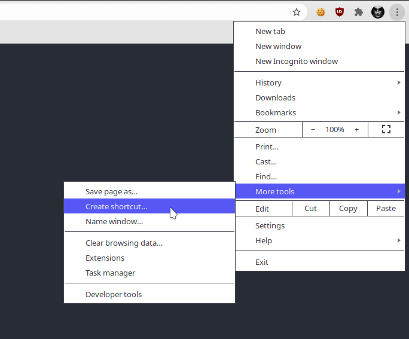

# General
Locky is a PWA hosted on Github page, first go to this URL

https://mister7f.github.io/locky

## Chrome Desktop
On Chrome desktop, go to `setting`, then `More tools` and finally `Create shortcut`.

## Chrome Mobile
Want to use the application on mobile ? Go on your browser, navigate to your Locky
instance, and `Settings`, then `Add to home screen`.

The application will look like a native application on your home screen.
