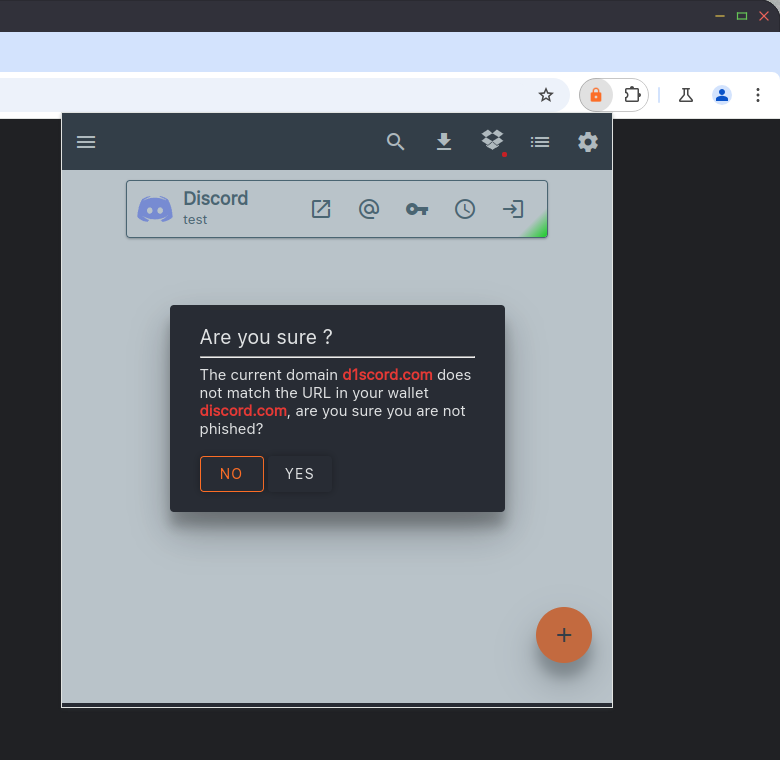

# Web Extension
Web Extension to automatically fill the form.

The 2FA (TOTP) code is copied if the clipboard after login on the website.

> https://youtu.be/Iayjx8GReKw

Phishing protection.

    

## Installation
1. Install the addon (see dev section, or check releases on Github)
2. Open the settings page
    - Chrome: left click on the addon icon, then click on option
    - Firefox: left click on the addon icon, click on the 3 dots, then preference
3. Enter the URL of your Locky instance

## Development

### Chrome
Chrome keeps the dev addon after a restart, you don't need to build the addon
-   Open chrome://extensions/
-   Activate the dev mode
-   "Load unpacked extension"

### Firefox
-   Open about:debugging#/runtime/this-firefox
-   "Load temporary addon"
-   Select manifest.json

Build the addon

1. Update the version in the manifest if needed

2. Make a zip file
> zip -r -FS ../firefox-locky.xpi * --exclude '*.git*,.prettierrc'

3. Upload the zip file on
> https://addons.mozilla.org/en-US/developers/addon/submit/upload-unlisted

4. Go to
> https://addons.mozilla.org/en-US/developers/addon/

5. Click on your addon name, then "Manage status and version", wait for the app to be validated

6. Click on the version you want to install, then click on file file ending with `.xpi`, it will ask you to install the app

7. Clean the zip
> rm ../firefox-locky.xpi

If you don't want to sign the zip, you can also use the dev version of Firefox,
- in about:config, set `xpinstall.signatures.required` to `false`
- drag and drop the xpi file

Sources
- https://extensionworkshop.com/documentation/publish/signing-and-distribution-overview/
- https://extensionworkshop.com/documentation/publish/package-your-extension/
- https://addons.mozilla.org/en-US/developers/

### Prettier

Before committing, run prettier:

> prettier --write *.js

