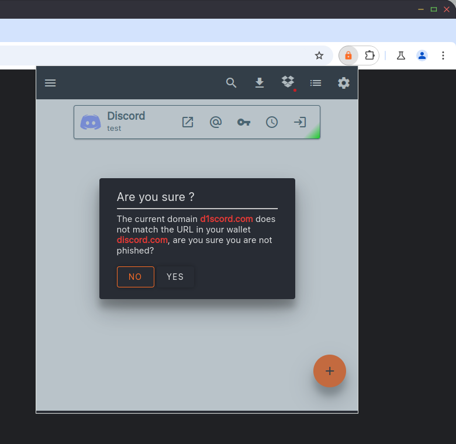

# Web Extension

Web Extension to automatically fill the form.

The 2FA (TOTP) code is copied in the clipboard after login on the website.

> https://youtu.be/Iayjx8GReKw

Phishing protection.

    

## Installation

1. Install the addon (see dev section, or check releases on Github)
2. Open the settings page
    - Chrome: right click on the addon icon, then click on Options
    - Firefox: right click on the addon icon, then click on Manage Extension and Preferences
3. Enter the URL of your Locky instance

Clicking the extension icon opens Locky in the browser sidebar.

A keyboard shortcut can be assigned from `chrome://extensions/shortcuts` in
Chrome or "Manage Extension Shortcuts" in Firefox.

## Development

### Chrome

Chrome keeps the dev addon after a restart, you don't need to build the addon

- Open chrome://extensions/
- Activate the dev mode
- "Load unpacked extension"

### Firefox

- Open about:debugging#/runtime/this-firefox
- "Load temporary addon"
- Run `./package-firefox.sh`
- Select `../firefox-locky.xpi`

Build the addon

1. Update the version in the manifest if needed

2. Build the Firefox package

> ./package-firefox.sh

3. Upload the zip file on

> https://addons.mozilla.org/en-US/developers/addon/submit/upload-unlisted

4. Go to

> https://addons.mozilla.org/en-US/developers/addon/

5. Click on your addon name, then "Manage status and version", wait for the app to be validated

6. Click on the version you want to install, then click on file file ending with `.xpi`, it will ask you to install the app

If you don't want to sign the zip, you can also use the dev version of Firefox,

- in about:config, set `xpinstall.signatures.required` to `false`
- drag and drop the xpi file

Sources

- https://extensionworkshop.com/documentation/publish/signing-and-distribution-overview/
- https://extensionworkshop.com/documentation/publish/package-your-extension/
- https://addons.mozilla.org/en-US/developers/

### Prettier

Before committing, run prettier:

> prettier --write *.html *.js
