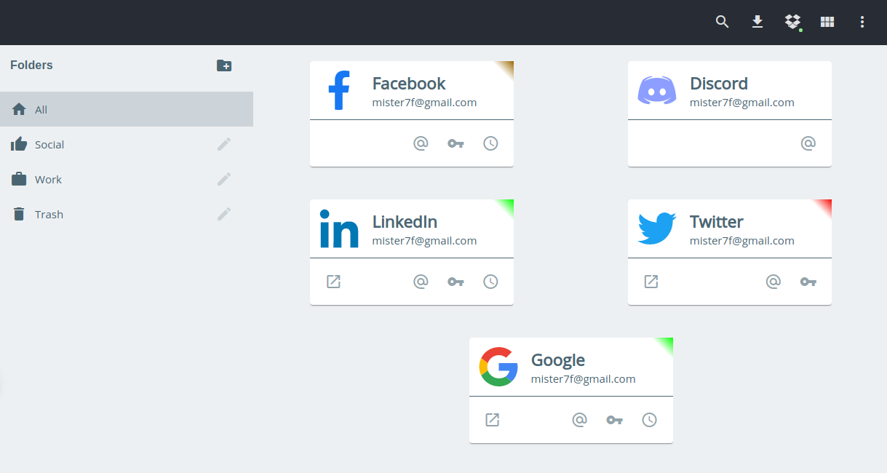

# Locky

    

    
    
    
    

Locky is a password manager for Desktop (Windows, Linux, Mac Os) and mobile.

It's a PWA server-less, it means that your data will never be uploaded on a server but you
can download them or save them to Dropbox to synchronize your accounts among your devices.

Your accounts are encrypted 2 times with modern algorithms;
- [Scrypt](https://en.wikipedia.org/wiki/Scrypt): for the key derivation
- [XChaCha20-Poly1305](https://www.cryptopp.com/wiki/XChaCha20): for a first encryption
- [AES-256](https://fr.wikipedia.org/wiki/Advanced_Encryption_Standard): for the second encryption

## Summary
- [Installation](doc/installation.md)
- [Features](doc/features.md)
- [Technologies used](doc/technologies.md)
- [Development](doc/development.md)
